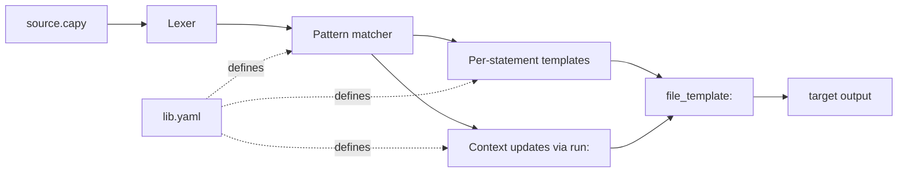

# Capy

> **Write something simple. Get something polished.**
>
> Capy turns plain, English-like descriptions into real artifacts —
> printable recipe cards, party invitations, weekly schedules,
> reading logs, full websites, code, configs. Anyone can use it;
> developers can extend it.

<iframe src="assets/hero/hero.html" width="100%" height="540" style="border: 0; border-radius: 12px; box-shadow: 0 12px 40px rgba(0,0,0,0.18); display: block; margin: 8px 0 28px;" title="Capy in action"></iframe>

[Try it in 5 minutes :material-rocket-launch:](getting-started.md){ .md-button .md-button--primary }
[For everyone :material-account-multiple:](for-everyone.md){ .md-button }
[Live demos :material-play-circle:](showcase.md){ .md-button }
[Browse all samples :material-folder-open:](https://github.com/luowensheng/capy/tree/main/samples){ .md-button }

---

## Capy in one paragraph

Most people end up writing the same things over and over — recipe
cards, invitations, meal plans, reading logs, configs, API specs,
codebases. Capy lets you describe **what you want** in a few plain
lines, and turns it into **what you'd otherwise have to format by
hand**. The vocabulary is whatever you (or someone before you)
designed for the task — `recipe`, `invite`, `endpoint`, `table`,
`scene`, whatever fits. No syntax to memorize. No code to learn.

The demos above show four ready-made vocabularies. There are 50+
more in the repo — and you can write your own (or ask an AI to)
in about thirty minutes.

---

## What Capy gives you

<div class="grid cards" markdown>

- :material-file-cog: **Generate any target text**

    Python, SQL, k8s YAML, Terraform HCL, Markdown, your custom
    format. Define what you want in a `.capy` library (or YAML if
    you prefer); Capy produces the target deterministically. Same
    engine, any output.

- :material-sync: **One source, many targets**

    The library *is* the grammar. Swap it and the same source file
    becomes SQL + JSON + Markdown, **or Python for Blender + Ruby for
    SketchUp + C# for Unity + C++/C# for Rhino + Python for Unreal**.
    Add a target by writing a library; never touch the source.

- :material-format-list-bulleted-type: **A declarative library beats a hand-rolled generator**

    Easier to read than 800 lines of string-builder code in Go or
    Python. Easier to diff, audit, and review. Non-engineers can
    follow what's possible by reading the library. Write libraries
    in **[Capy's native `.capy` syntax](capy-libraries.md)** (the
    default) or in **YAML** for downstream tooling — same engine,
    byte-identical output.

- :material-robot: **AI on either side, on your terms**

    Let an AI **write the library** so you skip parser design and
    get a friendly DSL for free. Let an AI **write the source**
    against the library — sandboxed, deterministic, 5–10× fewer
    tokens. Or both. [Read the AI guide →](ai-agents.md)

- :material-connection: **MCP server + Claude Code skill — drop-in AI integration**

    `capy-mcp` exposes three tools (`capy_check`, `capy_run`,
    `capy_run_file`) to any MCP client — Claude Desktop, Claude
    Code, Cursor, Zed. Plus a SKILL.md that tells agents *when* to
    reach for it. [MCP setup →](mcp.md) · [AI cookbook →](cookbook-ai.md)

- :material-shield-check: **Named variables, validated types**

    Every capture is a named, typed variable. Built-ins (`int`,
    `string`, `bool`, …) plus library-defined types with `pattern:`
    (regex), `options:` (enum), and `base:` (inheritance). Bad input
    is a transpile-time error pointing at the offending value, not a
    runtime surprise. [Types guide →](types.md)

- :material-file-document-check: **Grammar as contract — build before the library lands**

    Once `capy check lib.capy` parses, your DSL is a stable
    contract. Frontend devs can build against it before any target
    is implemented; add OpenAPI → TypeScript → Markdown targets
    later. Golden snapshots in CI prove the contract holds.
    [Pattern docs →](grammar-as-contract.md)

- :material-file-tree: **Multi-file projects + library imports**

    Declare any number of `file "src/main.py":` blocks in one library
    and `capy run --out-dir generated …` writes the whole project
    tree. Libraries can `import` other libraries — share types and
    syntax helpers across many DSLs. [Multi-file docs →](multi-file-and-imports.md)

- :material-rocket-launch: **Supercharge an existing syntax**

    You don't have to invent a new language. Take SQL, Markdown,
    Dockerfile, K8s manifests — anything textual — and put Capy
    macros on top. The output is **plain target syntax**; your
    existing runtime consumes it unchanged.
    [Pattern docs →](extending-existing-syntax.md)

- :material-language-go: **Embed in your Go program — no binary required**

    `go get github.com/luowensheng/capy`, then your program defines
    its own DSL inline:

    ```go
    lib, _ := capy.NewLibrary(`function greet ...`)
    out, _ := lib.Run(userInput)
    ```

    Ship a CLI with a friendly config DSL, build a Prisma-style code
    generator, give users hot-swappable grammars — in pure Go, no
    subprocess. [Embedding guide →](embedding.md)

</div>

---

## 60-second tour: nine ways to use Capy

Each tab shows the **Capy source** and the **generated target**.
Source is short and declarative; targets are real, runnable artifacts.

=== "Same source, 3 targets"

    The **same** `script.capy` (data declared once):

    ```
    user alice 30 active
    user bob   25 inactive
    user carol 42 active
    ```

    Three different libraries produce three real artifacts — without
    touching the source file:

    **`lib_sql.capy` →** SQL inserts

    ```sql
    INSERT INTO users (name, age, status) VALUES ('alice', 30, 'active');
    INSERT INTO users (name, age, status) VALUES ('bob', 25, 'inactive');
    INSERT INTO users (name, age, status) VALUES ('carol', 42, 'active');
    ```

    **`lib_json.capy` →** JSON

    ```json
    { "users": [
      { "name": "alice", "age": 30, "status": "active" },
      { "name": "bob",   "age": 25, "status": "inactive" },
      { "name": "carol", "age": 42, "status": "active" }
    ] }
    ```

    **`lib_md.capy` →** Markdown table

    ```
    | Name  | Age | Status   |
    |-------|-----|----------|
    | alice | 30  | active   |
    | bob   | 25  | inactive |
    | carol | 42  | active   |
    ```

    **The library IS the grammar.** Swap it and the same engine produces
    a completely different file. Add a new target by writing a new
    library; never touch the source. This is what nothing else does.

    [Full sample →](https://github.com/luowensheng/capy/tree/main/samples/multi-target-demo)

=== "Python"

    A small source language with imports + control flow:

    ```
    import json
    import os
    say "hello, world"

    if x
        say "x is set"
    end

    loop n in [1, 2, 3]
        say n
    end
    ```

    Generated **`out.py`**:

    ```python
    import json
    import os
    print("hello, world")
    if x:
        print("x is set")

    for n in [1, 2, 3]:
        print(n)
    ```

    [Full sample →](https://github.com/luowensheng/capy/tree/main/samples/transpile-py)

=== "Canvas game"

    12 lines of game-DSL produce a runnable HTML5 canvas page with
    sprites, key handlers, and a `requestAnimationFrame` loop:

    ```
    game "Block Hopper" 480 320

    sprite player "#4dd" 220 280 40 20
    sprite enemy  "#f64" 100 100 30 30

    on_key "ArrowLeft"  player -4 0
    on_key "ArrowRight" player  4 0

    tick enemy_bounce "sprites.enemy.x += 1; if (sprites.enemy.x > 450) sprites.enemy.x = 0;"
    ```

    Generated **`game.html`** (excerpt):

    ```javascript
    const sprites = {
      player: { x: 220, y: 280, w: 40, h: 20, color: "#4dd" },
      enemy:  { x: 100, y: 100, w: 30, h: 30, color: "#f64" },
    };
    function update() {
      if (keys["ArrowLeft"])  { sprites.player.x += -4; }
      if (keys["ArrowRight"]) { sprites.player.x +=  4; }
      sprites.enemy.x += 1; if (sprites.enemy.x > 450) sprites.enemy.x = 0;
    }
    function loop() { update(); draw(); requestAnimationFrame(loop); }
    loop();
    ```

    **12 lines → 67 lines of runnable HTML5 (5.5×).**
    [Full sample →](https://github.com/luowensheng/capy/tree/main/samples/transpile-canvas-game)

=== "Postgres schema"

    ```
    table users
        pk     id
        unique email "varchar(255)"
        col    name  "varchar(255) NOT NULL"
    end

    table posts
        pk     id
        fk     author_id -> users
        col    title "varchar(255) NOT NULL"
    end

    index posts author_id
    ```

    Generated **`schema.sql`**:

    ```sql
    CREATE TABLE users (
      id bigserial PRIMARY KEY,
      email varchar(255) UNIQUE NOT NULL,
      name varchar(255) NOT NULL
    );
    CREATE TABLE posts (
      id bigserial PRIMARY KEY,
      author_id bigint NOT NULL REFERENCES users(id),
      title varchar(255) NOT NULL
    );

    CREATE INDEX ix_posts_author_id ON posts(author_id);
    ```

    [Full sample →](https://github.com/luowensheng/capy/tree/main/samples/transpile-postgres-schema)

=== "Express server"

    ```
    port 8080

    use "morgan('combined')"
    get  "/health" "res.json({ok: true})"
    post "/users"  "const u = req.body; res.status(201).json({id: 42, ...u})"
    ```

    Generated **`server.js`**:

    ```javascript
    const express = require("express");
    const app = express();

    app.use(express.json());
    app.use(morgan('combined'));

    app.get("/health", (req, res) => {
      res.json({ok: true})
    });

    app.post("/users", (req, res) => {
      const u = req.body; res.status(201).json({id: 42, ...u})
    });

    app.listen(8080, () => { console.log("listening on", 8080); });
    ```

    [Full sample →](https://github.com/luowensheng/capy/tree/main/samples/transpile-express-server)

=== "Kubernetes"

    ```
    deployment capy_api
    image    "ghcr.io/luowensheng/capy:0.1.0"
    replicas 3
    port     8080
    ```

    Generated **`deployment.yaml`**:

    ```yaml
    apiVersion: apps/v1
    kind: Deployment
    metadata:
      name: capy_api
    spec:
      replicas: 3
      template:
        spec:
          containers:
            - name: capy_api
              image: ghcr.io/luowensheng/capy:0.1.0
              ports:
                - containerPort: 8080
    ```

    **4 lines → 13-line manifest (3.2×).**
    [Full sample →](https://github.com/luowensheng/capy/tree/main/samples/transpile-kubernetes)

=== "GraphQL schema"

    ```
    type User
        required id : "ID"
        required name : "String"
        field    role : "UserRole"
    end

    enum UserRole
        variant ADMIN
        variant MEMBER
    end
    ```

    Generated **`schema.graphql`**:

    ```graphql
    type User {
      id: ID!
      name: String!
      role: UserRole
    }
    enum UserRole {
      ADMIN
      MEMBER
    }
    ```

    [Full sample →](https://github.com/luowensheng/capy/tree/main/samples/transpile-graphql)

=== "Slack message"

    ```
    header  "📦 Build complete"
    section "Branch *main* built in *4m 12s* and is ready to deploy."
    divider
    section "Tests: 124/124 passing"
    button  "View build" "https://ci.example.com/build/1234"
    ```

    Generated **Slack Block Kit JSON** (POST to a webhook):

    ```json
    {
      "blocks": [
        { "type": "header", "text": { "type": "plain_text", "text": "📦 Build complete" } },
        { "type": "section", "text": { "type": "mrkdwn", "text": "Branch *main* built..." } },
        { "type": "divider" },
        { "type": "section", "text": { "type": "mrkdwn", "text": "Tests: 124/124 passing" } },
        { "type": "actions", "elements": [{ "type": "button", "text": "...", "url": "..." }] }
      ]
    }
    ```

    [Full sample →](https://github.com/luowensheng/capy/tree/main/samples/transpile-slack-blocks)

=== "React component"

    ```
    component Counter
        prop  label : "string"
        state count : "number" = 0
        effect "count" "document.title = 'count: ' + count"
        render "<div><h1>{label}: {count}</h1>..."
    end
    ```

    Generated **`Counter.tsx`**:

    ```tsx
    import React, { useState, useEffect } from "react";

    type CounterProps = { label: string };

    export function Counter(props: CounterProps) {
      const [count, setCount] = useState<number>(0);
      useEffect(() => {
        document.title = 'count: ' + count
      }, [count]);

      return (<div><h1>{label}: {count}</h1>...);
    }
    ```

    [Full sample →](https://github.com/luowensheng/capy/tree/main/samples/transpile-react-component)

=== "Assembly (x86-64)"

    ```
    program "sum-demo"
        var x = 5
        var y = 7
        add x y
        store result
        exit 0
    end
    ```

    Generated **`demo.asm`** (real NASM, assembles with `nasm -felf64`):

    ```asm
    section .data
        x: dq 0
        y: dq 0

    section .text
        global _start

    _start:
        mov rax, 5
        mov [x], rax
        mov rax, 7
        mov [y], rax
        mov rax, [x]
        add rax, [y]
        mov [result], rax
        mov rdi, 0
        mov rax, 60
        syscall
    ```

    A high-level source language → real assembly with a `.data`
    section auto-built from tracked symbols.
    [Full sample →](https://github.com/luowensheng/capy/tree/main/samples/assembly)

---

## Where Capy shines

Capy fits **anywhere you'd hand-roll a tiny parser or a hairy
Python/Go script to drive code generation**. The pattern shows up
in a lot of places once you start noticing it.

<div class="grid cards" markdown>

- :material-server: **Config-as-code at scale**

    50 services × 3 environments × k8s + Terraform + CI + Datadog
    monitors = boilerplate explosion. With Capy, each service is
    a 6-line file; the library encodes the policy. Bump a setting
    once, regenerate everything.

- :material-package-variant: **Internal scaffolding & generators**

    Replace Yeoman / Plop / Hygen / custom Go binaries that emit
    template files. The library is the conventions; the source is
    five lines. New generators ship by editing one YAML file.

- :material-sync: **One source → many targets**

    Define a user model once; generate Postgres DDL, TypeScript
    types, Pydantic, Zod, GraphQL — from the same source. Drift
    becomes impossible.

- :material-account-tie: **DSLs for domain experts**

    Give finance / legal / healthcare experts a notation that's
    natural for their domain and compiles to runnable code. The
    grammar becomes an audit boundary.

- :material-file-document-multiple: **Documentation generation**

    Stop letting README, OpenAPI, changelog, and release notes
    drift. One source produces all of them; CI re-runs when the
    source changes.

- :material-history: **Migration / refactor tools**

    Old format → new format. Library parses the old, emits the new.
    Self-documenting, type-checked, beats a one-off Python script.

- :material-robot: **AI builds the library FOR you**

    Don't want to learn parser design? Describe what you want; AI
    writes the YAML library. You then use the library to generate
    complex outputs — without ever asking AI to think about syntax.
    Capy becomes "easy mode" for custom DSLs.

- :material-shield-lock: **AI uses the library SAFELY**

    Have an agent that emits code? Make it emit Capy source against
    your library instead. Output is sandboxed (no `DROP TABLE`, no
    unauthorised hosts), 5–10× shorter (fewer tokens), and grammar-
    checked before reaching any system.

- :material-school: **Education & DSL design**

    Teach grammar, semantics, and output as separate concepts in
    one tiny artifact. Students build a calculator language in an
    afternoon — no yacc, no AST visitors, no codegen passes to
    explain. The library *is* the language.

- :material-shield-check: **Audit & compliance**

    Every artifact has a Capy-source lineage. "What's the policy
    for X?" = read function X. The grammar IS the policy.

</div>

[See all 14 use cases with concrete scenarios →](use-cases.md)

---

## How it works



Three things drive output:

1. **`args:`** — what shapes the parser recognises in source.
2. **`template:`** — what each match emits into the body.
3. **`run:`** — how each match updates a shared `context` (lists, maps, scalars).

A top-level **`file_template:`** assembles `body` + `context` into the
final file.

There are **no built-in keywords**. `if`, `loop`, `=`, blocks,
comments — all defined by the library, or not at all if your DSL
doesn't need them.

---

## Capy and AI — both directions

Capy is a developer tool. People write libraries; people write
source; people generate output. Everything works without ever
involving AI.

But the same model makes Capy *unusually well-suited* to AI
workflows — in **both directions**:

### Direction 1: AI builds the library, humans use it

You want a custom DSL for your domain but don't want to learn parser
design? Describe it to an LLM:

> "I want a small language where my designers can declare game
> levels with rooms, exits, and items, and I want it to compile to
> a JSON file the engine eats."

The LLM emits a `lib.yaml`. Your designers write `script.capy`
files; Capy compiles them. **You never have to teach the LLM your
target format at use time** — the library encodes it once.

This is the pattern that quietly unlocks the most value: AI does
the **one-time** parser design (which is hard); humans do the
**every-time** content writing (which is easy). The library is
the friendly, predictable interface between them.

### Direction 2: AI emits source, the library sandboxes it

Have a code-generating agent? Point it at a Capy library instead
of letting it emit raw code. The agent can only produce shapes the
library defined — by construction:

- A SQL DSL whose `TableName` is an enum **cannot** emit
  `DROP TABLE`.
- A shell DSL whose `Command` whitelists `ls`/`cat`/`grep`
  **cannot** invoke `rm`.
- An HTTP DSL whose `Host` is a regex **cannot** call
  `evil-corp.example.com`.

Plus the agent emits 5–10× fewer output tokens (no boilerplate to
write), with deterministic output (same source → same target every
time).

### The combination

You can use both directions in the same workflow. AI designs the
library; agents use it. Humans write source occasionally; the rest
of the time agents do. Everyone — humans and machines — talks to
the system through the same friendly DSL.

[Full AI agents guide → token cost math, sandboxing patterns,
Claude Code skill, Cursor / Continue / Aider integration](ai-agents.md)

---

## Why Capy fits AI workflows (the details)

If you want the deep version: four properties unique to Capy that
matter for AI workflows.

### 1. Sandboxing — the grammar is the boundary

Anything not declared in the library is a **parse error**. Whatever
an agent emits is, by construction, within the library's contract.

```yaml
# A restricted SQL DSL with a table whitelist.
types:
  TableName:
    options: ["users", "posts", "comments"]

functions:
  query:
    args:
      - { kind: literal, value: "select" }
      - { kind: capture, name: cols, type: any }
      - { kind: literal, value: "from" }
      - { kind: capture, name: tbl,  type: TableName }   # ← enforced
      - { kind: literal, value: "where" }
      - { kind: capture, name: cond, type: any }
    template: "SELECT {{ .cols }} FROM {{ .tbl }} WHERE {{ .cond }};\n"
```

The LLM can emit `select id from users where active`. It **cannot** emit:

- `DROP TABLE users` — there's no `DROP` pattern in the library.
- `select * from secrets where ...` — `secrets` isn't in `options`.
- `'; rm -rf /'` — wouldn't even tokenize as a Capy statement.

No prompt-injection class of attack works here. No post-hoc output
filtering. **The grammar is the boundary.**

Same shape for:

- **Shell DSLs** that whitelist `Command` to `ls`/`cat`/`grep` —
  agent can't `rm`.
- **HTTP DSLs** with `Host` regex'd to your own domain — agent can't
  hit `evil-corp.example.com`.
- **Code-gen DSLs** that only define safe JSX patterns — no XSS
  via raw HTML.

### 2. Reduced token usage

| Mode             | LLM emits | Engine produces |
|------------------|-----------|-----------------|
| Naive codegen    | ~800 tokens of Python (Flask app) | (none) |
| Capy             | ~50 tokens of Capy source | ~800 tokens of Python (deterministic) |

The library is in context **once** (or loaded on demand from a file).
After that, every generation emits short structured source.

In a single call the savings are 5–10×. **In an agent loop the gap
compounds** — same library, hundreds of generations, per-call cost
approaches the source size.

Concrete ratios from samples:

| Demo | Source lines | Output lines | Ratio |
|------|--------------|--------------|-------|
| Canvas game     | 12 | 67 | **5.5×** |
| Landing page    | 9  | 54 | **6.0×** |
| Express server  | 8  | 24 | **3.0×** |
| Kubernetes      | 4  | 13 | **3.2×** |
| Postgres schema | 18 | 21 | 1.2× (mostly structure) |
| XState machine  | 9  | 30 | **3.3×** |

The ratios understate the win. The interesting cost isn't lines —
it's tokens, and target code has high token-per-line density
(boilerplate, repeated identifiers, type annotations).

### 3. Reduced task complexity for the agent

Without Capy, generating a Flask app means the agent has to remember:
imports, Flask app instantiation, `jsonify`/`request` wiring, route
decorator syntax, response codes, JSON shapes. Each detail is a
place to make a mistake.

With Capy, the agent reasons at the level of **`route post "/users"
create_user "..."`** — the shape of the API it's building. Everything
syntactic lives in the library.

The agent gets:

- **No import bookkeeping.** Library tracks imports via `run:`.
- **No indentation worry.** Block templates handle nesting.
- **No framework idioms.** Library encodes Flask, Express, FastAPI,
  etc., once.
- **No boilerplate review.** Output is template-driven.

The agent's job collapses to: *which functions, with which arguments,
in what order?*

### 4. Reduced failure points

| Property | Raw LLM codegen | Capy + LLM |
|----------|-----------------|------------|
| Output passes a grammar check | ⚠️ usually | ✅ always |
| Output passes type validation | ⚠️ sometimes | ✅ always (when types declared) |
| Output uses only allowed APIs / tables / hosts | ⚠️ depends on prompt | ✅ enforced by library |
| Same input produces same output | ❌ | ✅ |
| Easy to audit what the agent can produce | ❌ | ✅ (`capy check lib.capy`) |
| Single point of fix when target changes | ❌ | ✅ (edit one library) |

The combined effect: fewer retries, fewer guardrails to write,
fewer review cycles. The agent contributes content; the library
contributes correctness.

[Full AI agents guide → token math, three workflow patterns,
integrations with Claude Code / Cursor / Continue / Aider](ai-agents.md)

---

## Install

```sh
# Go users
go install github.com/luowensheng/capy/cmd/capy@latest

# macOS / Linux (binary, no Go required)
curl -fsSL https://raw.githubusercontent.com/luowensheng/capy/main/scripts/install.sh | sh
```

Verify:

```sh
capy version
capy help
```

---

## Where to go next

<div class="grid cards" markdown>

- :material-rocket-launch: **[Getting started](getting-started.md)**

    Install, run a sample, and understand the four things every
    library controls.

- :material-pencil: **[Library authoring](library-authoring.md)**

    The reference walkthrough for writing your own `lib.capy`.

- :material-robot: **[Capy for AI agents](ai-agents.md)**

    Token cost math, three sandboxing patterns, integrations with
    Claude Code, Cursor, Continue, and Aider.

- :material-book: **[Tutorials](tutorials/01-hello-world.md)**

    Four progressive lessons: Hello → config DSL → Python transpiler
    → custom operators.

- :material-toolbox: **[Cookbook](cookbook.md)**

    Recipes for common patterns.

- :material-list-box: **[Feature reference](features.md)**

    Flat list of everything Capy ships with.

- :material-help-circle: **[FAQ](faq.md)**

    Common questions answered.

- :material-folder-open: **[50 demos on GitHub](https://github.com/luowensheng/capy/tree/main/samples)**

    Full library + script + verified golden output for every kind
    of target.

</div>

---

## All 50 demos at a glance

The tour above showed 9 demos. Here's the full catalogue:

### Web frontend (7)

`canvas-game` · `css-animations` · `react-component` · `landing-page`
· `html-component` · `transpile-form` · `transpile-email-html`

### Backend (3)

`express-server` (Node) · `flask-app` (Python) · `fastapi-app` (Python)

### Code generation (10)

`transpile-py` · `transpile-typescript` · `transpile-go` ·
`transpile-sql` · `transpile-protobuf` · `transpile-graphql` ·
`transpile-tests` · `transpile-cli` (Cobra Go) · `transpile-bash`
· `assembly` (x86-64 NASM)

### Configuration / IaC (13)

`transpile-json` · `transpile-env` · `transpile-dockerfile` ·
`transpile-makefile` · `transpile-nginx` · `transpile-systemd` ·
`transpile-kubernetes` · `transpile-gh-actions` · `transpile-cron`
· `transpile-terraform` · `transpile-openapi` ·
`transpile-prometheus-alerts` · `transpile-chrome-extension`

### Schemas / models (4)

`transpile-postgres-schema` · `transpile-prisma-schema` ·
`transpile-zod-schema` · `transpile-xstate-machine`

### Docs / data / diagrams (10)

`transpile-markdown-todo` · `transpile-blog` ·
`transpile-changelog` · `transpile-resume` ·
`transpile-api-docs` · `transpile-invoice` · `transpile-csv` ·
`transpile-mermaid` · `transpile-statemachine` ·
`transpile-slack-blocks`

### Concept demos (3)

`empty-engine` (proof of zero default grammar) · `types`
(validation) · `scene-dsl` (declarative)

[Browse all 50 demos on GitHub →](https://github.com/luowensheng/capy/tree/main/samples)

---

## Why Capy, not …?

Not a templating engine (it has a parser). Not a parser generator
(it has a runtime). Something in between: **a configurable
transpiler**, with the configuration written as data.

| Tool | What it does | What Capy adds |
|------|--------------|----------------|
| Jinja, Go templates | Substitute values into text | A real parser + accumulated context + types |
| ANTLR, lark, tree-sitter | Parse a language you defined | Targeted at code generation; ships with a runtime; no Java/Python required |
| Custom Go transpilers | Full control | A YAML schema replaces hundreds of lines of code per project |
| gomplate, ytt | Powerful templating with data | A source language with custom syntax, not just template inputs |
| Raw LLM codegen | Maximum flexibility | Determinism + sandboxing + token compression for agents |

Use Capy when you'd otherwise hand-roll a tiny parser to drive
code-generation: configuration languages, scaffolding tools, DSLs
for domain experts, source-to-source rewrites, and **especially
constrained LLM output**.

---

## Status

**Pre-1.0.** The library YAML schema may change between minor
versions. See
[CHANGELOG](https://github.com/luowensheng/capy/blob/main/CHANGELOG.md)
for what's stable, [roadmap](roadmap.md) for what's planned.

[MIT licensed](https://github.com/luowensheng/capy/blob/main/LICENSE). Built in Go. Single binary, no runtime dependencies.
